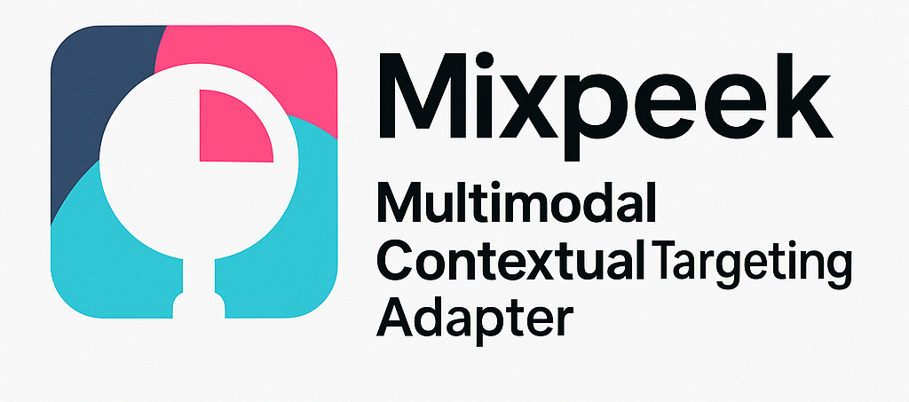
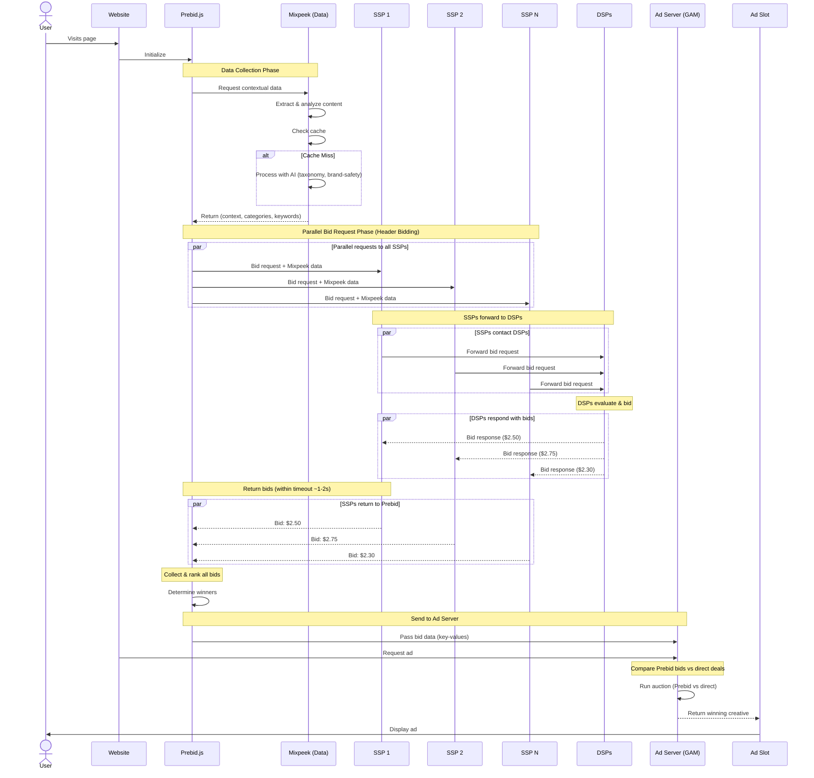

<p align="center">
  
</p>

# Mixpeek Contextual Adapter for Prebid.js

[](https://www.npmjs.com/package/@mixpeek/prebid)
[](https://www.npmjs.com/package/@mixpeek/prebid)
[](https://opensource.org/licenses/Apache-2.0)
[](https://www.npmjs.com/package/@mixpeek/prebid)
[](https://bundlephobia.com/package/@mixpeek/prebid)
[](https://www.npmjs.com/package/@mixpeek/prebid)
[](https://github.com/mixpeek/prebid)
[](https://github.com/mixpeek/prebid/pulls)

## 🎯 Overview

The Mixpeek Contextual Adapter enables publishers and SSPs using **Prebid.js** to enrich bid requests with real-time contextual data powered by Mixpeek's multimodal AI engine. This adapter provides:

- **Privacy-First Targeting**: No cookies, just content-based context
- **Multimodal Analysis**: Text, images, video, and audio processing
- **IAB Taxonomy**: Automatic classification into IAB content categories
- **Brand Safety**: Real-time brand safety scoring
- **Ad Adjacency Awareness**: Tracks previous ad to avoid repetition and improve user experience
- **Sub-100ms Performance**: Optimized for header bidding speed requirements
- **Graceful Fallbacks**: Never blocks the auction

### How It Works (Simplified)

```
USER → WEBSITE → PREBID.JS
                    │
                    ├──→ MIXPEEK Connector
                    │    (Analyze page content + previous ad)
                    │    ↓
                    │    Returns: IAB cats, safety, keywords
                    │    ↓
                 (enrich bid request)
                    │
                    ├──→ SSP 1 ──→ DSPs ──→ Bid $3.25 ✓ (higher!)
                    ├──→ SSP 2 ──→ DSPs ──→ Bid $2.90
                    └──→ SSP 3 ──→ DSPs ──→ Bid $2.75
                    
                 (collect bids)
                    │
                    ▼
                AD SERVER (GAM)
                    │
                    ▼
               MORE RELEVANT AD
```

## 🚀 Quick Start

### Installation

```bash
npm install @mixpeek/prebid
```

### Basic Setup

```javascript
// 1. Include the Mixpeek RTD module
import '@mixpeek/prebid'

// 2. Configure Mixpeek as an RTD provider
pbjs.setConfig({
  realTimeData: {
    auctionDelay: 250,  // Max time to wait for contextual data (ms)
    dataProviders: [{
      name: 'mixpeek',
      waitForIt: true,  // Wait for Mixpeek before starting auction
      params: {
        apiKey: 'YOUR_MIXPEEK_API_KEY',
        collectionId: 'your-collection-id',
        endpoint: 'https://api.mixpeek.com',
        
        namespace: 'your-namespace', // optional
        featureExtractors: ['taxonomy', 'brand-safety'],
        mode: 'page', // 'page', 'video', or 'auto'
        timeout: 250,
        cacheTTL: 300 // seconds
      }
    }]
  }
})

// 3. The RTD module automatically enriches bid requests!
pbjs.requestBids({
  adUnits: [...],
  bidsBackHandler: function(bids) {
    // Bids now include Mixpeek contextual data in ortb2
  }
})
```

## 📋 Prerequisites

1. **Mixpeek Account**: Sign up at [mixpeek.com](https://mixpeek.com/start)
2. **API Key**: Generate an API key in your Mixpeek dashboard
3. **Collection**: Create a collection with feature extractors configured
4. **Prebid.js**: Version 6.0.0 or higher

## 🔧 Configuration Options

### RTD Configuration

| Option | Type | Required | Default | Description |
|--------|------|----------|---------|-------------|
| `realTimeData.auctionDelay` | number | ❌ | 250 | Max time to wait for all RTD providers (ms) |
| `realTimeData.dataProviders[].name` | string | ✅ | - | Must be `'mixpeek'` |
| `realTimeData.dataProviders[].waitForIt` | boolean | ❌ | false | Wait for Mixpeek before starting auction |

### Mixpeek Parameters

| Option | Type | Required | Default | Description |
|--------|------|----------|---------|-------------|
| `params.apiKey` | string | ✅ | - | Your Mixpeek API key |
| `params.collectionId` | string | ✅ | - | Mixpeek collection ID for document processing |
| `params.endpoint` | string | ❌ | `https://api.mixpeek.com` | Mixpeek API endpoint (production) |
| `params.namespace` | string | ❌ | - | Optional namespace for data isolation |
| `params.featureExtractors` | array | ❌ | `['taxonomy']` | Feature extractors to use (taxonomy, brand-safety, etc.) |
| `params.mode` | string | ❌ | `auto` | Content mode: `page`, `video`, `image`, or `auto` |
| `params.timeout` | number | ❌ | 250 | API request timeout in milliseconds |
| `params.cacheTTL` | number | ❌ | 300 | Cache TTL in seconds |
| `params.enableCache` | boolean | ❌ | `true` | Enable local caching |
| `params.debug` | boolean | ❌ | `false` | Enable debug logging |
| `params.batchSize` | number | ❌ | 1 | Number of concurrent requests |
| `params.retryAttempts` | number | ❌ | 2 | Number of retry attempts on failure |

## 📊 Output: OpenRTB 2.6 Data Structure

The RTD module injects contextual data into your bid requests using the OpenRTB 2.6 standard:

### Site-Level Data (`ortb2.site.content`)
```javascript
{
  "ortb2": {
    "site": {
      "content": {
        "cat": ["IAB19-11"],              // IAB Content Categories
        "cattax": 6,                       // IAB Content Taxonomy v3.0
        "genre": "Technology - AI",        // Human-readable category
        "keywords": "ai,technology,ml",    // Extracted keywords
        "language": "en",                  // Content language
        "title": "Article Title",          // Page title
        "url": "https://example.com",      // Page URL
        "ext": {
          "data": {
            "mixpeek": {
              "score": 0.94,               // Confidence score
              "brandSafety": 0.98,         // Brand safety score
              "sentiment": "positive",      // Content sentiment
              "embeddingId": "emb_abc123"  // Embedding ID
            }
          }
        }
      }
    }
  }
}
```

### Impression-Level Data (`ortb2Imp.ext.data`)
```javascript
{
  // Current page context
  "hb_mixpeek_taxonomy": "IAB19-11",       // Primary IAB taxonomy code
  "hb_mixpeek_category": "Technology > AI", // Human-readable category
  "hb_mixpeek_node": "node_tech_ai",       // Taxonomy node ID
  "hb_mixpeek_path": "tech/ai/ml",         // Hierarchical path
  "hb_mixpeek_score": "0.94",              // Confidence score
  "hb_mixpeek_safety": "0.98",             // Brand safety score
  "hb_mixpeek_keywords": "AI,ML,tech",     // Extracted keywords
  "hb_mixpeek_embed": "emb_abc123",        // Embedding ID for retrieval
  
  // Previous ad context (adjacency awareness)
  "hb_mixpeek_prev_creative": "12345",     // Last creative ID shown
  "hb_mixpeek_prev_bidder": "appnexus",    // Last bidder that won
  "hb_mixpeek_prev_adunit": "sidebar-1",   // Last ad unit code
  "hb_mixpeek_prev_cat": "IAB18-1,IAB12-3" // Last ad categories
}
```

## 🎥 Usage Examples

### Page Context (Articles, Blogs)

```javascript
pbjs.setConfig({
  realTimeData: {
    auctionDelay: 250,
    dataProviders: [{
      name: 'mixpeek',
      waitForIt: true,
      params: {
        apiKey: 'sk_your_api_key',
        collectionId: 'col_articles',
        mode: 'page',
        featureExtractors: ['taxonomy', 'brand-safety', 'keywords']
      }
    }]
  }
})
```

### Video Context (Pre-roll, Mid-roll)

```javascript
pbjs.setConfig({
  realTimeData: {
    auctionDelay: 300,  // Longer delay for video processing
    dataProviders: [{
      name: 'mixpeek',
      waitForIt: true,
      params: {
        apiKey: 'sk_your_api_key',
        collectionId: 'col_videos',
        mode: 'video',
        videoSelector: '#main-video', // CSS selector for video element
        featureExtractors: ['taxonomy', 'scene-detection']
      }
    }]
  }
})
```

### Multi-Content Auto-Detection

```javascript
pbjs.setConfig({
  realTimeData: {
    auctionDelay: 250,
    dataProviders: [{
      name: 'mixpeek',
      waitForIt: true,
      params: {
        apiKey: 'sk_your_api_key',
        collectionId: 'col_mixed',
        mode: 'auto', // Automatically detects page, video, or image content
        featureExtractors: ['taxonomy', 'brand-safety', 'clustering']
      }
    }]
  }
})
```

## 🏗️ How It Works



## 🧪 Testing

```bash
# Run all tests
npm test

# Run with coverage
npm run test:coverage

# Watch mode
npm run test:watch
```

## 📖 Advanced Configuration

### Custom Feature Extractors

```javascript
pbjs.setConfig({
  realTimeData: {
    auctionDelay: 250,
    dataProviders: [{
      name: 'mixpeek',
      waitForIt: true,
      params: {
        apiKey: 'sk_your_api_key',
        collectionId: 'col_custom',
        customExtractors: [
          {
            feature_extractor_id: 'sentiment-analyzer',
            payload: {
              model: 'sentiment-v2',
              threshold: 0.7
            }
          }
        ]
      }
    }]
  }
})
```

### Conditional Loading

```javascript
// Only enrich on specific pages
if (window.location.pathname.startsWith('/articles/')) {
  pbjs.setConfig({
    realTimeData: {
      auctionDelay: 250,
      dataProviders: [{
        name: 'mixpeek',
        waitForIt: true,
        params: {
          apiKey: 'sk_your_api_key',
          collectionId: 'col_articles',
          mode: 'page'
        }
      }]
    }
  })
}
```

### Event Callbacks

```javascript
pbjs.onEvent('mixpeekContextReady', function(context) {
  console.log('Mixpeek context loaded:', context)
  // Custom analytics or modifications
})

pbjs.onEvent('mixpeekContextError', function(error) {
  console.error('Mixpeek context error:', error)
  // Custom error handling
})
```

## 🔄 Previous Ad Tracking (Adjacency Awareness)

The adapter automatically tracks the most recently served ad to enable adjacency-aware targeting. This helps:

- **Avoid Ad Repetition**: Prevent showing the same creative or category repeatedly
- **Frequency Capping**: Build frequency cap rules based on previous impressions
- **Competitive Separation**: Avoid showing competing brands consecutively
- **Enhanced User Experience**: Improve ad diversity and relevance

### How It Works

1. **Automatic Tracking**: On every `bidResponse` event, the adapter stores minimal information about the winning ad
2. **Lightweight Storage**: Data is stored in memory + localStorage (privacy-safe, no PII)
3. **Targeting Keys**: Previous ad data is automatically injected into subsequent bid requests

### Data Tracked

| Field | Description | Example |
|-------|-------------|---------|
| `creativeId` | Winning creative ID | `"12345"` |
| `bidder` | Winning bidder code | `"appnexus"` |
| `adUnitCode` | Ad unit that served the ad | `"sidebar-1"` |
| `categories` | IAB categories of the ad | `["IAB18-1", "IAB12-3"]` |
| `timestamp` | When the ad was served | `1697123456789` |

### Targeting Keys Injected

The following keys are automatically added to `ortb2Imp.ext.data`:

- `hb_mixpeek_prev_creative` - Last creative ID
- `hb_mixpeek_prev_bidder` - Last winning bidder
- `hb_mixpeek_prev_adunit` - Last ad unit code
- `hb_mixpeek_prev_cat` - Last ad categories (comma-separated)

### SSP/DSP Usage

SSPs and DSPs can use these keys for advanced targeting rules:

```javascript
// Example: Avoid showing the same creative twice in a row
if (bidRequest.ortb2Imp.ext.data.hb_mixpeek_prev_creative === currentCreative.id) {
  // Skip this creative or reduce bid
}

// Example: Competitive separation
const prevCategories = bidRequest.ortb2Imp.ext.data.hb_mixpeek_prev_cat?.split(',') || []
if (prevCategories.includes('IAB18-1') && currentAd.category === 'IAB18-1') {
  // Don't show competing fashion ads back-to-back
}
```

### Privacy & Storage

- **No User Tracking**: Only ad metadata is stored, no user identifiers or behavior
- **Session-Scoped**: Data persists across page views within a session
- **Local Storage**: Falls back to memory-only if localStorage is unavailable
- **Minimal Data**: Only essential fields are stored (< 200 bytes)
- **GDPR/CCPA Compliant**: No consent required as it doesn't track users

### Programmatic Control

You can access the previous ad tracker directly if needed:

```javascript
import previousAdTracker from '@mixpeek/prebid/utils/previousAdTracker'

// Get last ad info
const lastAd = previousAdTracker.getLast()
console.log('Last creative:', lastAd?.creativeId)

// Clear history (e.g., on user logout or page type change)
previousAdTracker.clear()
```

## 🔒 Security & Privacy

- **No PII**: The adapter never sends user identifiers or cookies
- **Content-Only**: Only page/video content is analyzed
- **HTTPS**: All API calls use TLS encryption
- **API Key Safety**: Store API keys securely (environment variables, server-side rendering)
- **GDPR/CCPA Compliant**: Contextual targeting doesn't require user consent

## 📚 Documentation

### User Guides
- [Quick Start](QUICKSTART.md) - Get running in 5 minutes
- [Integration Guide](docs/integration-guide.md) - Step-by-step integration
- [API Reference](docs/api-reference.md) - Complete API documentation
- [Testing Guide](TESTING.md) - How to test the adapter
- [Endpoint Configuration](ENDPOINTS.md) - Configure API endpoints
- [Health Check](docs/health-check.md) - Health check configuration

### Developer Resources
- [Mixpeek API Docs](https://docs.mixpeek.com) - Platform documentation
- [Internal Planning](tasks/) - Gap analysis & implementation plans (internal)

## 🤝 Support

- **Email**: support@mixpeek.com
- **GitHub Issues**: [Create an issue](https://github.com/mixpeek/prebid/issues)
- **Documentation**: [docs.mixpeek.com](https://docs.mixpeek.com)
- **Slack Community**: [Join our Slack](https://mixpeek.com/slack)

## 📄 License

Apache 2.0 - see [LICENSE](LICENSE) file for details.

## 🙏 Credits

Built with ❤️ by [Mixpeek](https://mixpeek.com)

Integrates with [Prebid.js](https://prebid.org) - an open-source header bidding solution

